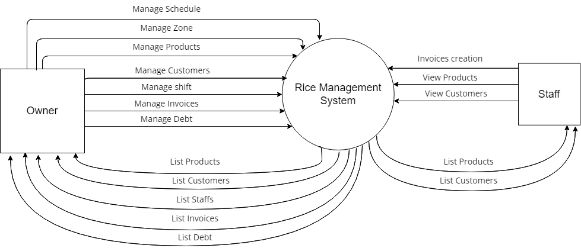
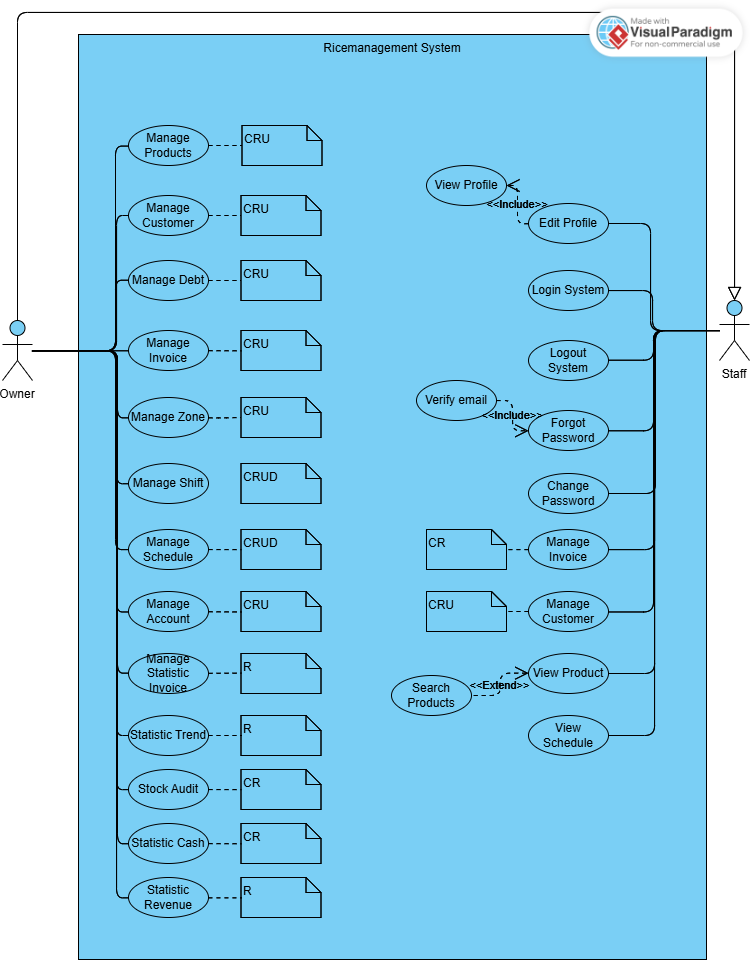
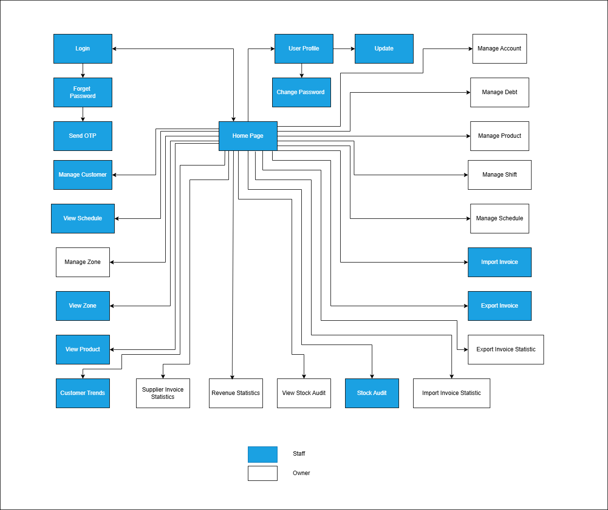

Requirement & Design Specification

**Rice Management**

**Version: 1.0**

> -- Hanoi, February 10 2025 --

# I. Overview

1\. System Context

The Rice Management System is a system that helps store owners reduce
labor, employees can easily manage rice based on product information
from the store owner. Each role interacts with the system through
different functions:

● Administrator: manages user accounts.

● Owner: manages products, customers, staffs, invoices, debt

● Employees: can create invoices, view goods, customer lists

## 1. User Requirements

### 1.1 Actors

| STT | **Actor** | **Description**                                                                                                                                     |
|-----|-----------|-----------------------------------------------------------------------------------------------------------------------------------------------------|
| 1   | Owner     | Views rice list & details, adds items to cart (login required for checkout), edits personal profile, accesses purchase history,                    |
|     |           | manages product catalog (add/edit/remove products), processes payments, purchases rice, manages schedule of staff, manages shift,                  |
|     |           | and tracks transaction history.                                                                                                                     |
| 2   | Staff     | Views rice list & details, adds items to cart, processes payments, accesses purchase history, and assists customers.                               |

### 1.2 User Case

In this project, the topic our team works on is Ricemanagement.
Ricemanagement was developed to serve the management of the store of
rice. The app can transmit owner knowledge to the staff, so when they
are absent, the staff can manage and sell the rice based on information
of the application supply that customers need. Rice management is
optimally designed to bring an easy experience to users, suit all needs
and minimize possible risks.

The goals that Rice management aims to:

-Optimized interface, easy to use

-Diverse and safe payment system

\- High ability to secure customer information.

We hope Ricemanagement will be a website that users trust and we always
listen to feedback and ideas to improve.

#### a. Diagram(s)

*Figure 1: Use case Diagram*

### 2.3 Descriptions

  | ID  | Use Case                  | Actors        | Use Case Description                                                                                                                                     |
|-----|---------------------------|---------------|-----------------------------------------------------------------------------------------------------------------------------------------------------------|
| 01  | User Login                | Staff, Owner  | Users enter username and password. If the account is in the database, access is allowed.                                                                 |
| 02  | Forget Password           | Staff, Owner  | Allows users to recover their password when they forget it so they can continue accessing their account.                                                 |
| 03  | Change Password           | Staff, Owner  | After logging in, users can change their password in their user profile.                                                                                  |
| 04  | User Profile              | Staff, Owner  | Personal user information is displayed such as fullname, email, phone number, etc. Users can view and update their profile.                             |
| 05  | Update Profile            | Staff, Owner  | Users can change account information such as name, email, phone, address.                                                                                 |
| 06  | Manage Product            | Owner         | Owner can manage the list of products: update cost, inventory, and add/update/delete products.                                                           |
| 07  | Manage Customer           | Owner         | View customer information (name, phone, email, address), update details, and ban customers.                                                              |
| 08  | Manage Debt               | Owner         | Control customer debt information, including invoice dates and amounts; can add or subtract debt.                                                        |
| 09  | Manage Staff              | Owner         | Set shifts, create new slots, assign staff to specific days and times.                                                                                   |
| 10  | Manage Invoice            | Owner         | View bills and the dates they were created.                                                                                                               |
| 11  | Manage Account            | Owner         | Control accounts of both staff and owner, set account info, and ban users.                                                                               |
| 12  | Sale                      | Staff, Owner  | Create invoices when selling products by filling invoice form.                                                                                           |
| 13  | Manage Shift              | Owner         | Add, edit, delete, and hide shifts that are no longer active.                                                                                            |
| 14  | Manage Schedule           | Owner         | Add, edit, and delete shifts to assign to employees for each working day.                                                                                |
| 15  | View Schedule             | Staff, Owner  | View weekly work schedule.                                                                                                                                |
| 16  | Manage Zone               | Owner         | Control list of zones, add/edit zones, and manage products available in each zone.                                                                       |
| 17  | Stock Audit               | Owner, Staff  | Owner views stock audit history; staff can create stock audit forms.                                                                                     |
| 18  | User Trend                | Owner, Staff  | View user trends and top products.                                                                                                                        |
| 19  | Revenue Statistic         | Owner         | View revenue by day, week, and month.                                                                                                                     |
| 20  | Supplier Invoice Statistic| Owner         | View import costs by week and month.                                                                                                                      |

> *Table 1:* Descriptions use case diagram

## 3. System Functionalities

### 3.1 Screens Flow

> *Figure 2: Screens Flow*

